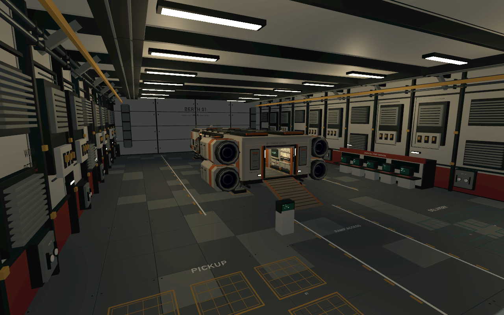
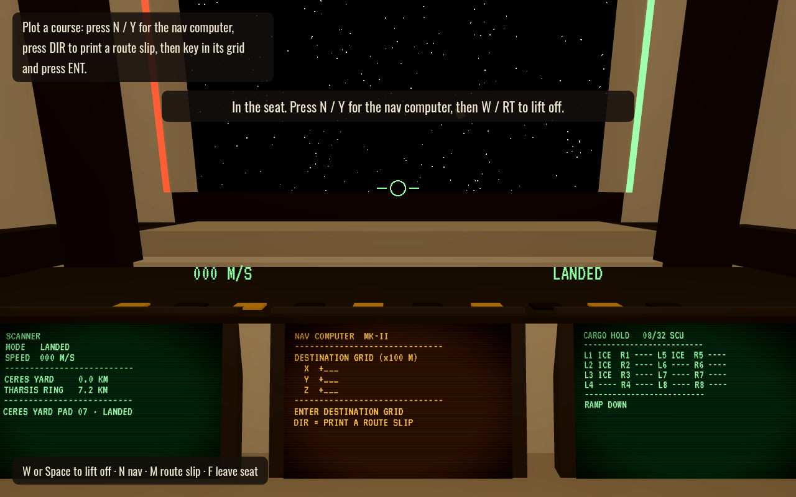

## Blender station playtest

Double-click **[Test Station.command](Test%20Station.command)** to play the complete cargo, flight and survival loop inside the approved Blender station and hangar. Start at the **CONTRACTS** screen; press **F** to use it and **F1** for the walkthrough. The dispatch counter also provides provisions, repairs, fuel and delivery completion. [Station playtest guide](docs/STATION_TEST.md).

The ship and cargo use their existing scale. Walk the loading ramp, pack and lock freight, open the station door through COMMS, fly out, travel and dock nose-first into the destination hangar. All fifteen economy locations currently share this first station family. This session saves separately from the older builds.

Actual Godot viewport:



## Complete ship-life test

Launch **[Test Ship Life.command](Test%20Ship%20Life.command)** for the combined cargo, original cockpit/manual flight, and survival session. It starts at the dock with contracts, a PROVISIONS kiosk and a repair technician. Press **F1** in game for the walkthrough, or read the [complete test guide](docs/SHIP_LIFE_TEST.md).

Food preparation, five-bite meals, washing plates and glasses, periodic showers, hab inventory/checklist printing, daily sensor care, shared world time, 06:00 wake-ups, black-screen time-skip progress, emergency rest, paid supplies/fuel, and optional contract advances are implemented here. Both ordinary cockpit departure and an explicitly labelled **start test** prepared-cruise option lead into real flight, arrival and cargo delivery.

At HAB, `print` produces a sheet to collect with **F**; **H** stows/retrieves it, **Tab** inspects the held sheet, and **F** at the galley recycling bin throws it away. Hands are empty by default; the lifting gun appears only while carrying a box. Read the assigned sensor names on the paper, then use Engineering `check <sensor>`, `trim <a|b|c> <amount>`, and `test` to solve calibration puzzles. Failed tests show **DEGRADED** and can be retried.

The clock advances in five-minute display steps, with a full game day taking **60 real minutes** (18× slower than the initial survival test). Flight durations retain their existing real-time length.

The hab bench works between meals: **F** on its cushion to sit, **G** to stand, **T** while seated to fold/lower the desk. From the aisle, **F** on the empty desk also folds/lowers it. Clear plates first; the saved session remembers the furniture positions.

This session saves separately as `ship_life_v1.json`; **F5** saves and **F9** loads. An emergency end-of-run uses F9 to restore its departure checkpoint. Existing `Fly Longhaul.command` progress and the cargo-only test are preserved. The default project scene still opens the previous Longhaul build; use the new launcher for all combined loops.

## Project documentation

Start with the [gameplay overview and documentation index](docs/GAMEPLAY.md) for every implemented loop and its detailed guide. The [current handoff](docs/HANDOFF.md) supports resuming work; [cargo and economy](docs/CARGO.md) covers freight end to end; the [development guide](docs/DEVELOPMENT.md) maps code, saves, tuning and validation. The [survival design](docs/SURVIVAL_DESIGN.md) records agreed rules and superseded proposals.

## Cargo loop test

The new focused cargo trial is `scenes/cargo_trial.tscn`. On macOS, double-click **Test Cargo.command**. It starts you at Ceres Yard beside a contract computer, with an empty packing bay in the Blender Longhaul. The normal flight game and its save are unchanged; this trial starts fresh each launch.

Press **F** at CONTRACTS, type **jobs**, then **accept 1** (small), **accept 2** (full), or choose a collection offer. **Esc** closes the computer. Goods spawn in COLLECTION on the left when you are at the pickup station. A collection job first sends you empty to its supplier, then brings the consignment back to its employer.

**WASD/mouse** walk/look, **Shift** hurry, **F** lift/place/use, **R** turn the held case, **T** tip it, **Z** select automatic/rear/front rack depth, **P** show an optional valid packing order. Rack cell numbers match the plan. Green ghosts are valid, red ghosts explain the blockage. Cases need full support and a clear path into/out of the rack. Remove top/front cases before cases they obstruct. Pickup, delivery, and all four amber staging pads use 4×4-cell grids with three vertical layers. Aim at a floor cell to place beside other cargo, or at the top of a box to stack. Every bottom cell needs support, and upper boxes must be removed before their supports. Floor grids have access from all four sides. All staged cases must be removed before departure.

After every case is racked, press **F** at the CARGO LOCK button near the forward end of the hold. The ship confirms departure clearance. The dock DEPARTURE computer accepts **depart** to skip the flight for this trial, charge the quoted fuel, advance the economy, and arrive at the next contract stop. At the destination, release the cargo locks, unload every case onto the marked DELIVERY grids (multiple boxes may share a grid), then press **F** at the DELIVERY completion computer. Payment happens once; delivered cases are removed.

The 15-station trial economy produces/consumes commodities and performs coarse background trades. Offers derive from actual surplus and demand, rank profitable matches, reserve goods and destination capacity on acceptance, and fix the fee. Fees include both legs of collection jobs, fuel, estimated journey time, handling, upkeep and profit. A fuel advance finances the planned route. No trading, deadlines, trolley, or cargo purchase is required. Trial travel costs are fixed estimates, not yet quotes from the live flight planner.

Packing uses two 2×3×4-cell racks (0.45 m cells): small jobs fill one rack with 4–6 cases; full jobs fill both with 8–12. Manifests are generated from valid, supported, accessible solutions before the cases are shuffled. The new loop remains separate from the normal flight game's older single-case freight system until playtesting is complete. Other ship systems are scenery in this focused trial.

Validation: 47 packing assertions across 600 generated manifests, 446 economy assertions, and 108 physical/controller integration assertions. Run `cargo_trial_packing_test.gd` and `cargo_trial_economy_test.gd` using Godot `--headless --script`; run the trial with `--headless --fixed-fps 60 -- --cargo-trial-test` for end-to-end checks. Tests verify the normal flight save remains byte-for-byte unchanged.

---

## Retained standalone build: Longhaul flight

The default scene is now the detailed Longhaul with physical cockpit command-line terminals, manual station flight, automatic interstation travel, printed checklists and route sheets, shipboard life, and optional docking assistance. On macOS, double-click `Fly Longhaul.command` (Godot installed in Applications).

Start at the **CHECKLIST** computer and type `print` for the command sheet. Look at a screen and press **F** to type. `help` is a command reference. **Tab** pins/stows a sheet beside the active screen, **Shift+Tab** cycles sheets, and **Delete** recycles the visible sheet. **P** reads a full page outside terminals. Read [the flight guide](docs/FLIGHT.md) for the departure sequence and controls. The ship automatically resumes its last saved flight.

The upper screens show station radar, relative velocity along each ship axis, and destination distance. Use `display NAV` (or another screen name) at any cockpit terminal to choose what it displays. NAV stays engaged until you type `manual` or propulsion fails; sleep ends at least 90 seconds before the arrival braking point. For docking, `approach` assigns your berth automatically, then `auto dock` can guide the final approach when close and slow enough.

The current world is **Aurel: one ringed gas giant, eight moving moons, and fifteen dockable stations**. Stations range from established inner ports to moon industries and remote research or relay facilities. Use `stations 1`, `stations 2`, or `stations 3` at CHART/NAV to browse, and `station <id>` to read a destination's role. `map system` shows a clean diagram with Aurel and eight moons in a side directory. `show <moon>` opens its stations; `show aurel` includes all directly orbiting stations, near and far. `map route` and `map local` open journey and approach views. Views stay selected until changed and are saved per screen. Type `return` at any cockpit terminal to go back to its previous screen, including maps, details, and help. Normal journeys target roughly 5–30 minutes of real play; the system uses compressed distances and orbital time. See [the Aurel system guide](docs/AUREL_SYSTEM.md) for the map, station directory, and simulation boundaries.

Freight now connects every station in the detailed Longhaul build. At COMMS, use `jobs`, then `accept <station ID or number>`. Collect the case from the station pallet beside the ramp, carry it aboard, and secure it before plotting the trip. At the destination, unload it to the pallet and type `deliver` for payment. `contract` shows the active job; `crew load` and `crew unload` each cost 25 credits. Jobs have no deadlines. This build supports one consignment at a time; the older prototype's commodity market remains separate.

Older flight saves are moved safely to their last origin berth when the Aurel chart loads. Fuel, supplies and completed journeys are retained; plot a fresh route before departure.

The original game remains available in `scenes/main.tscn`, the earlier economic prototype in `scenes/life_slice.tscn`, and the unchanged design study in `scenes/longhaul_preview.tscn`.

---

# Space Trucking

A first-person space trading game in voxel cassette futurism. Fly your ship, land in a station, walk to the exchange, buy cargo, carry it into your hold, then fly it somewhere that pays more.

Built with Godot 4 for macOS and Steam Deck (1280x800, keyboard/mouse or gamepad).



## Run it on a Mac

1. Download **Godot 4.7** (standard version, not .NET) from <https://godotengine.org/download/macos/> and drag it into Applications.
   - The first time you open it, macOS may block it. If so, right-click Godot.app, choose Open, then confirm.
2. Clone or download this repo.
3. Open Godot. In the Project Manager, click **Import**, pick `project.godot` from this folder, and confirm.
4. Press **F5** (or the ▶ play button at the top right) to play.

The first import takes a few seconds while Godot builds its cache.

## Original prototype: the first run

The instructions below describe `scenes/main.tscn`. Use [the flight guide](docs/FLIGHT.md) for the default Longhaul build.

You start on foot on pad 07 at Ceres Yard, behind your ship, the Kestrel-9.

1. Walk through the door at the back of the hangar into the concourse and up to the **Commodity Exchange** terminal on the right. Press **F** to use it.
2. Buy some **water ice** (cheap at Ceres). Bought crates appear on pallet 07-B next to your pad.
3. Walk back to the hangar. Aim at a crate and press **F** to lift it with your tractor tool, then aim into your ship's hold and press **F** again to set it down. A green ghost shows where it will go.
   - Aim at a crate that's already down to stack the new one on top of it. The hold and the pallet both take two layers.
   - Lifting from a stack always takes the top crate.
4. Walk to the front of the ship and press **F** at the pilot seat.
5. Press **N** for the nav computer, then press **DIR** (or **Tab**) to swing over to the route printer on its left. From the seat you can also press **M** to go straight there.
   - Pick **Tharsis Ring** with **W/S** and press **F** to print. The route slip clips onto the board to the right of the keypad, and the view returns to the keypad.
   - Key in the grid from the slip: **X +024, Y +003, Z -068**. Use **+/-** (or the minus key) to flip a sign, then press **ENT**.
   - Press **N** or **Esc** to look back up.
6. Press **W** to lift off. Point the nose at the amber diamond and press **C** for cruise. Cruise drops out on its own near the station.
7. Press **L** to request docking. Fly into the hangar, slow down over pad 07 (the amber circle) and press **L** again to land.
8. Walk to the exchange in the concourse and press **R** to sell.
   - The dock crew unloads anything still in your hold, for a 10% fee.
   - Crates you carry over yourself, or set on pallet 07-B first, sell at full price. A crate in your hands sells too.

## Hauling contracts

The **Contract Board** is the amber terminal past the exchange in every concourse. Press **F** to use it.

- Each board posts five jobs, with at least one to every other station. Pick one with **W/S** and press **F** to sign it. Its crates appear on pallet 07-B for free, with a cream **JOB** band. The sign line shows how much room your hold has left once your other jobs are aboard, and warns when a job won't fit.
- Load them into your hold like any cargo and fly to the job's destination. The route printer marks job destinations with `*`.
- At the destination's contract board, press **F** on the job to deliver it. Every crate must be there: in your hands, on pallet 07-B, or in your docked hold. The dock crew charges 10% of the hold crates' share of the pay.
- Job crates belong to the client. The exchange won't buy them.
- You can hold four jobs at once. Press **R** twice on one of your jobs to abandon it. That costs a quarter of its pay, and the client takes its crates back.
- Boards turn over: every three minutes each one drops its oldest offer and posts a new one.

## Controls

| Action | Keyboard / mouse | Gamepad |
| --- | --- | --- |
| Walk / look | WASD / mouse | Left stick / right stick |
| Sprint | Shift | L3 |
| Use, lift, place | F | A |
| Back / close | Esc | B |
| Pause (controls list, quit) | P | Start |
| Throttle up / down | W / S | RT / LT |
| Strafe | A / D | Right stick X |
| Up / down thrust | Space / Z | Right stick Y |
| Pitch / yaw | Mouse or arrow keys | Left stick |
| Roll | Q / E | LB / RB |
| Nav computer | N | Y |
| Route printer (in the seat) | M | DIR on the keypad |
| Request docking / land | L | X |
| Cruise | C | L3 |
| Sell all of a good (exchange) | R | X |
| Abandon a job (contract board, press twice) | R | X |

On the nav computer, you can type digits directly, or click the keys, or move with the D-pad and press A. Enter is ENT, Tab is DIR, Backspace deletes a digit and X (or Delete) is CLR.

On the route printer, W/S (or the D-pad) picks a station and F (or A) prints its slip. Esc goes back to the keypad.

## What is in this build

- One star system with five stations: Ceres Yard, Tharsis Ring, Vesta Forge, Europa Deep and Callisto Hub. Each one makes some goods and pays well for others.
- Assisted flight with cruise, docking clearance and an autoland onto the pad.
- A walkable hangar, concourse and commodity exchange.
- Cargo crates that snap into a 16-slot hold grid, stacked two high, and an 18-slot pallet by each pad.
- A route printer in the cockpit that prints each station's grid on a slip you can read while you key it in.
- Selling from the pallet, from your hands, or straight from the hold through the dock crew.
- Prices that move as you buy and sell.
- Hauling contracts at every station's contract board.

NPC traders come next.

## For developers

Everything is built in code from `scripts/`, so there are no large scene files to merge.

| File | What it does |
| --- | --- |
| `scripts/main.gd` | World setup, mode switching (on foot, piloting, terminal), self-test and screenshot capture |
| `scripts/game_state.gd` | Autoload with credits, markets, stations, contract offers and jobs, and input bindings |
| `scripts/ship.gd` | The ship: hull, hold, cockpit, assisted flight, cruise, docking |
| `scripts/cockpit.gd` | Cockpit art: CRT monitor housings, gauge hood with live dials, toggles and lamps, canopy, seat |
| `scripts/nav_computer.gd` | The physical keypad and nav CRT |
| `scripts/nav_directory.gd` | The route printer: station list, printed slips and the slip clipboard |
| `scripts/slot.gd`, `scripts/crate.gd` | Cargo slots (with stacking) and crates |
| `scripts/station.gd` | Station hull, hangar, pad, pallet and concourse |
| `scripts/player.gd` | On-foot movement and the crate tractor tool |
| `scripts/hud.gd`, `scripts/trade_terminal_ui.gd` | Flight overlay, prompts and the exchange screen |
| `scripts/contract_terminal_ui.gd` | The contract board screen: sign, deliver and abandon jobs |
| `scripts/vox.gd`, `scripts/collider_audit.gd` | Box helpers (including `Vox.Batch`, which merges static boxes into one draw call) and the collider audit |

A headless test plays the whole loop the way a player does, with aim, walking and key presses (buy, load and stack, sign a hauling job and carry its crates aboard, print a route slip, key it in, fly, cruise, dock, land, unload, sell, deliver the job, abandon another), and prints `SELFTEST OK`:

```sh
godot --headless --path . -- --selftest
```

The self-test also audits the ship's colliders: every visible part bigger than a knob must have a matching collider, and every collider must be filled by something visible. To run only that check:

```sh
godot --headless --path . -- --audit
```

To save screenshots of the main views into `captures/`, run with a display:

```sh
godot --path . -- --capture
```

## Credits

Fonts: [VT323](https://fonts.google.com/specimen/VT323) and [Oswald](https://fonts.google.com/specimen/Oswald), both under the SIL Open Font License (see `assets/fonts/`).
