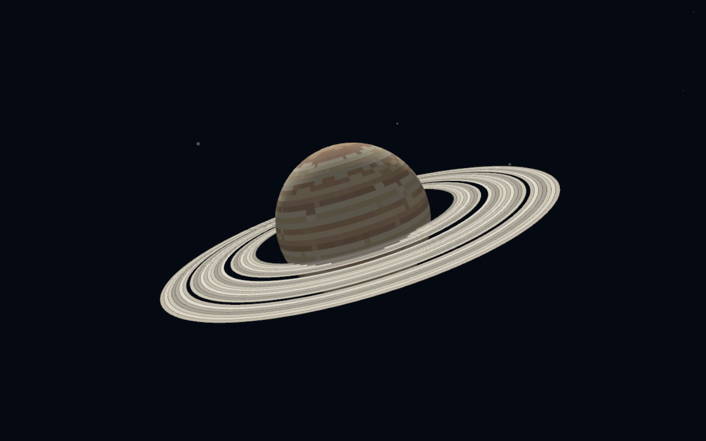
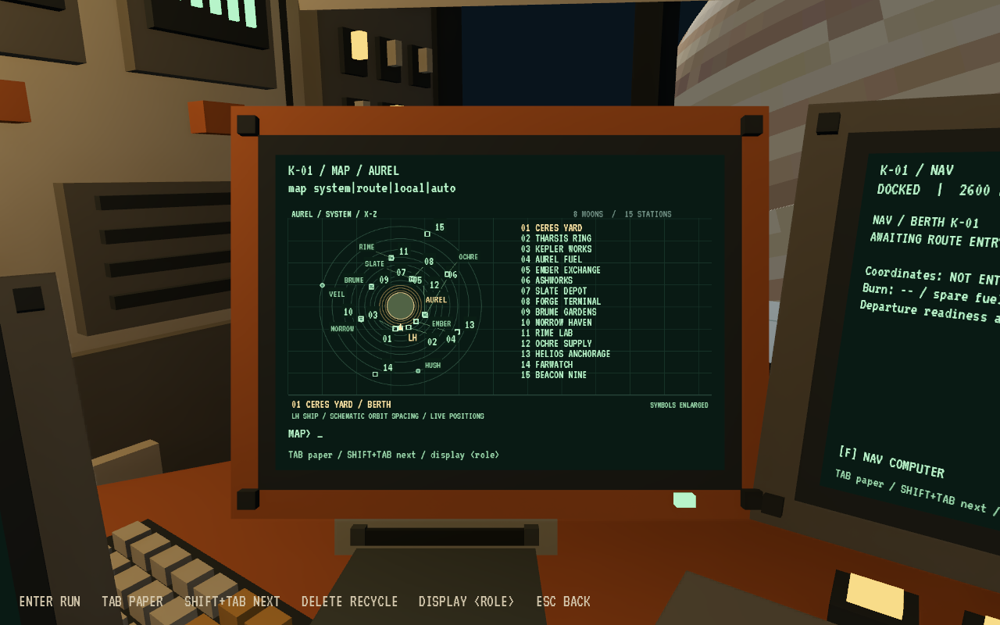
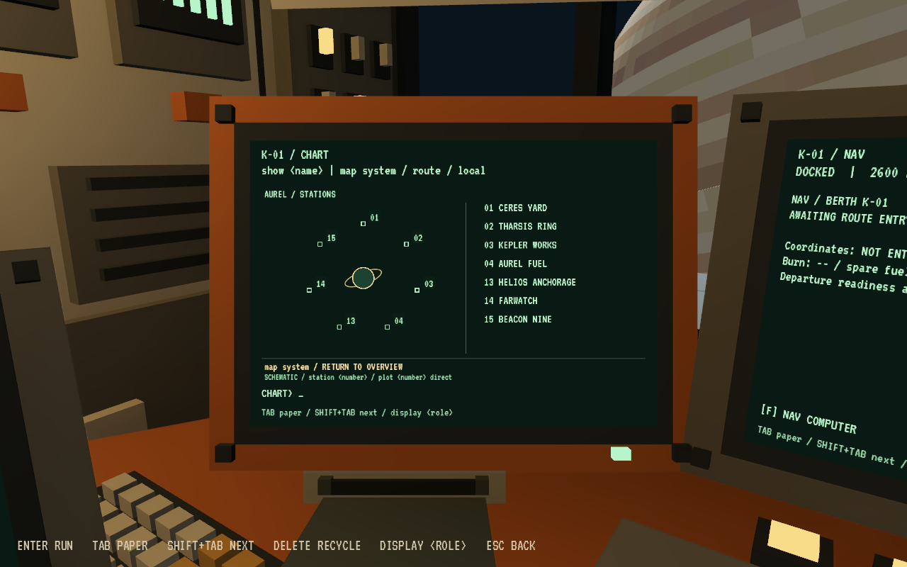

# Aurel — the station network

Scope: geography, map browsing and route geometry are shared by standalone flight and the current combined ship-life session. For current freight, services, clock and saves use [CARGO.md](CARGO.md) and [SHIP_LIFE_TEST.md](SHIP_LIFE_TEST.md). The standalone freight/save sections below are retained for that older entry point.

Longhaul is the player's home. The current setting has one ringed gas giant, eight moons and fifteen orbital stations: established inner ports, industries around six moons, and isolated outer facilities. All station destinations use the same completed cockpit preparation, manual departure, automatic journey, manual/assisted arrival and ship-life loop. Moons are scenery and orbital anchors; there are no landable surfaces or atmospheric flight areas.

## Geography

Aurel's catalogue radius is 58,000 km. Its rings span 76,000–140,000 km from the planet center. The eight moons are Ember, Slate, Brume, Morrow, Rime, Ochre, Hush and Veil. They range from 215,000 km to 2,100,000 km orbital radius. Hush and Veil have no local station, preserving remote scenery and space for later expansion. Brume and Morrow have visible atmospheres without atmospheric gameplay.

| No. | CLI ID | Station | Region | Function |
| --- | --- | --- | --- | --- |
| 01 | `ceres` | Ceres Yard | Inner ports | Central freight exchange |
| 02 | `tharsis` | Tharsis Ring | Inner ports | Commercial port |
| 03 | `kepler` | Kepler Works | Inner ports | Shipbuilding and heavy repairs |
| 04 | `aurel` | Aurel Fuel | Inner ports | Propellant processing |
| 05 | `ember` | Ember Exchange | Ember | Regional freight |
| 06 | `ashworks` | Ashworks | Ember | Materials processing |
| 07 | `slate` | Slate Depot | Slate | Ore storage and dispatch |
| 08 | `forge` | Forge Terminal | Slate | Industrial fabrication |
| 09 | `brume` | Brume Gardens | Brume | Greenhouse cooperative |
| 10 | `morrow` | Morrow Haven | Morrow | Residential station and clinic |
| 11 | `rime` | Rime Lab | Rime | Ice and atmospheric research |
| 12 | `ochre` | Ochre Supply | Ochre | Remote resupply |
| 13 | `helios` | Helios Anchorage | Outer system | Freight interchange |
| 14 | `farwatch` | Farwatch | Outer system | Observatory |
| 15 | `beacon` | Beacon Nine | Outer system | Navigation and communications |

The first four internal station indexes retain the old IDs for save compatibility. Display numbers follow the geographic order above; command lookup resolves either form.

## Navigation and route discovery

At CHART or NAV:

- `stations 1`, `stations 2`, `stations 3`: five destinations per page, sized to fit the physical terminal.
- `station brume` or `station 09`: station name, region, purpose, imports and exports.
- At CHART, `plot brume direct` or `plot 09 economy`: calculate a safe route, then print the sheet.
- Enter the printed coordinates, burn and reserve at NAV as before; `load` selects the destination.
- `map system`: an unlabeled schematic of Aurel, its rings and eight moon orbits. The side directory lists Aurel and all eight moons; no stations, routes or ship markers clutter the overview.
- `show aurel`: the seven stations that orbit Aurel directly, including Helios Anchorage, Farwatch and Beacon Nine. There is no separate outer category.
- `show <moon>`: only that moon and its stations. Hush and Veil explicitly show “No orbital facilities.” Station numbers on the schematic match the adjacent station directory.
- `map route`: the active transfer, ship, departure and destination. `map local`: the nearby reference station for approach. These retain actual flight geometry.
- `return`: go back one screen without retyping its command. This works on every terminal, including help and station details; repeated returns retrace the browsing history. `map system` remains a direct jump to the overview.
- Browsing uses the full CHART or MAP display. Orbital lanes and station positions are arranged for readability, with no implied distance or bearing scale. Use RADAR/VELOCITY for docking guidance.
- The selected view stays until changed, including when refocusing the terminal, progressing through flight phases, or saving/reloading. Returning with `map system` highlights the last browsed body. Browsing never selects a destination or alters a flight plan.
- Both CHART and MAP accept `station <number>` for details and `plot <number> direct|economy` to calculate a transfer. Existing station IDs remain valid.

Each trip has a computed future intercept and smooth waypoint legs. NAV samples moving moons at future route times, conservatively avoids the entire ring envelope, and checks required acceleration and fuel before offering the route. The controller then uses actual six-axis thrust to follow that path. Delayed manual departures trigger an updated interception calculation; no second coordinate transcription is required.

Normal-time journey targets are about 5–8 minutes locally, 10–15 minutes regionally, and 20–30 minutes across the system. At the initial epoch, all 210 directed station pairs completed in 5m49s–26m52s in automated physical-flight checks, including departure and nose-first assisted berth capture. A complete economy-route run at epoch 60,000 seconds observed 6m17s–27m30s. Both final runs depart with only the quoted fuel plus 200 kg reserve and retain the reserve after docking. Waiting deliberately in manual flight can take longer. Station motion, coolant, cargo and available fuel influence the route. Economy routes trade speed for consumption where geometry permits. Sleep can shorten the player's wait, but always wakes 90 seconds before final arrival braking.

## Scale and simulation boundaries

This is a deliberately compressed game system. One navigation-world unit corresponds to four orbital catalogue kilometres when placing bodies and their orbits. The ship, pads, six-axis controls and near-berth readouts use local metre-scale geometry. Printed NAV coordinates are navigation-grid kilometres; they should be copied as printed rather than converted from orbital catalogue values. Standalone flight uses sixty simulated clock seconds per normal play second. The combined ship-life session instead uses 24 shipboard seconds per real second, displays five-minute increments, and advances time while docked as well. This clock change does not rescale the flight geometry.

Aurel gravity affects ship motion. Moons and stations follow analytic Kepler-style orbital ephemerides, including stations orbiting moving moons. Moon gravity acting on the ship, N-body dynamics and optimized slingshot routes are not implemented. The automatic trajectory controller may apply sustained corrective thrust; it is not a claim of an optimal ballistic transfer. Manual flight retains momentum and the existing thrust/fuel behavior.

The conservative ring exclusion sphere makes route safety straightforward and keeps the player out of ring material. It also excludes otherwise physically possible crossings above or below the rings. That is an intentional first implementation limit.

## Standalone freight and station life

The combined session replaces this older COMMS freight loop with reserved dynamic station contracts, multi-case packing, paid provisions/repairs, optional advances and coarse background market trading. See [CARGO.md](CARGO.md).

The station network supports delivery contracts in the detailed Longhaul scene. COMMS provides `jobs 1|2|3`, `accept <station>`, `contract`, `crew load`, `crew unload`, and `deliver`. A delivery case can be handled manually using the ship's cargo workflow, or station crews can move it for a fee. There are no delivery deadlines. Trading independently purchased commodities, expanded shops and a complete economy remain broader work beyond the delivery contract integration.

The common berth preserves the existing cargo ramp, station access and nose-first docking behavior. Station supplies and repair services remain accessible through COMMS. The station's industry and imports/exports establish its identity and the delivery network's rationale.

## Standalone saves and validation

Combined saves and their validation are documented in [DEVELOPMENT.md](DEVELOPMENT.md#save-ownership-and-compatibility).

Pre-Aurel flight saves retain the player's supplies, needs, fuel, cargo/room state and journey count, but are moved safely to their last known origin berth because the old coordinates belong to a different world. The old route is cleared, and the game explicitly announces the chart update. Replot before departure. Existing paper is kept as historical paper; it cannot silently validate a new route.

Aurel saves serialize the actual position, velocity and planned trajectory legs. Reloading an active route resumes awake at normal time. Autopilot, arrival hold and nose-first docking persist under the same rules as the previous flight release.

Final direct and economy all-pairs runs each pass 1,931 assertions, for 3,862 checks across two orbital configurations. `longhaul_system_test.gd` can test all 210 directed pairs, complete physical flights, moving-body clearances, route budgets with only quoted fuel, multiple orbital epochs, directory paging, numeric destinations and migration. The integrated regression suite passes 322 flight, paper/control, display, return-navigation, map and freight checks. See [FLIGHT.md](FLIGHT.md) for the commands.
