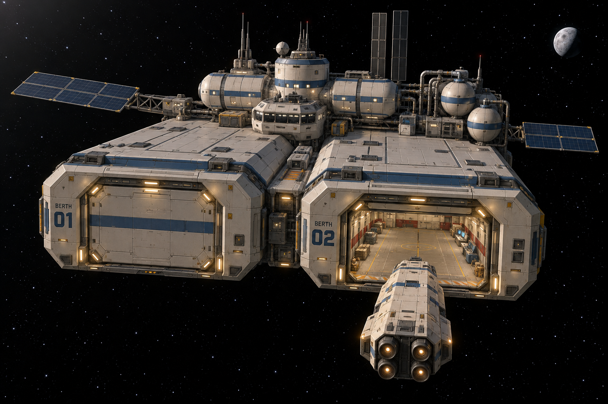

# Twin-bay resupply depot concept

Generated 2026-10-06 using the built-in image-generation tool. Concept only; awaiting user approval before Blender modeling or gameplay changes.

This second exterior family uses a compact, broad cream/blue depot with full-depth hangar modules, rear habitation and utility modules, tanks, radiators and solar wings. It is designed around the existing shared hangar; dimensions in the prompt are modeling targets, not measurements validated from this illustration.

## Accepted station requirement

The user requires every station to have at least two full-size hangars so NPC freight operations can continue while the player occupies their berth indefinitely. Reserve one berth for the player and a separate berth for NPC arrivals, cargo operations and departures. Both need independent door control and unobstructed approach paths. Reuse the standard interior footprint and cargo/service anchors.

The current industrial station already has two modeled bays, but BAY 02 remains closed visual art. Functional NPC berth control, traffic scheduling and cargo activity are planned, not implemented by this concept task. Additional NPC ships can queue outside the NPC approach corridor; player dwell time must never block their work.

The complete generation prompt is in [prompt.txt](prompt.txt). No inspiration-folder images were used.
